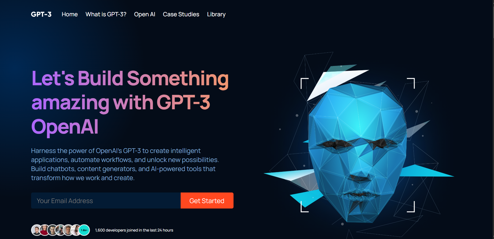

# GPT-3 Landing Page

A modern, responsive marketing website for OpenAI's GPT-3 platform. This project showcases a professional SaaS landing page with clean UI/UX, smooth animations, and reusable React components.



## 🚀 Live Demo

[View Live Demo](#) <!-- Add your deployed link here -->

## ✨ Features

- **Responsive Design** - Fully optimized for desktop, tablet, and mobile devices
- **Modern UI/UX** - Gradient effects, glassmorphism, and contemporary design patterns
- **Component-Based Architecture** - Reusable React components for scalability
- **Smooth Animations** - Engaging user interactions and transitions
- **SEO Optimized** - Semantic HTML and meta tags for better search visibility
- **Performance Focused** - Optimized build with minimal bundle size

## 🛠️ Built With

- **React.js** - Frontend framework
- **CSS3** - Modern styling with gradients and animations
- **React Icons** - Icon library
- **Create React App** - Build toolchain

## 📂 Project Structure
gpt3-landing-page/
├── public/
├── src/
│   ├── components/
│   │   ├── article/
│   │   ├── brand/
│   │   ├── cta/
│   │   ├── feature/
│   │   └── navbar/
│   ├── containers/
│   │   ├── blog/
│   │   ├── features/
│   │   ├── footer/
│   │   ├── header/
│   │   ├── possibility/
│   │   └── whatGPT3/
│   ├── App.js
│   ├── App.css
│   └── index.js
└── README.md

## 🚦 Getting Started

### Prerequisites

- Node.js (v14 or higher)
- npm or yarn

### Installation

1. Clone the repository
```bash
git clone https://github.com/yourusername/gpt3-landing-page.git
```

2. Navigate to project directory
```bash
cd gpt3-landing-page
```

3. Install dependencies
```bash
npm install
```

4. Start development server
```bash
npm start
```

5. Open [http://localhost:3000](http://localhost:3000) to view it in your browser

## 📦 Build for Production

```bash
npm run build
```

Builds the app for production to the `build` folder. The build is optimized and ready for deployment.

## 🎨 Key Sections

- **Hero Section** - Eye-catching introduction with email capture
- **Brand Showcase** - Trusted by leading companies
- **What is GPT-3** - Feature cards highlighting capabilities
- **Features Section** - Detailed benefits and use cases
- **Possibility Section** - Call-to-action with immersive imagery
- **Blog Section** - Latest articles and resources
- **Footer** - Links and contact information

## 🤝 Contributing

Contributions, issues, and feature requests are welcome!

## 📝 License

This project is for educational and portfolio purposes.

## 👨‍💻 Author

**Rocky Isnimwe**
- Location: Kigali, Rwanda
- Email: rockyisnimwe9@gmail.com
- Phone: +250 791 039 241

## 🙏 Acknowledgments

- Design inspiration from modern SaaS landing pages
- OpenAI for GPT-3 technology reference
- Create React App for the development setup

---

⭐ Star this repo if you found it helpful!